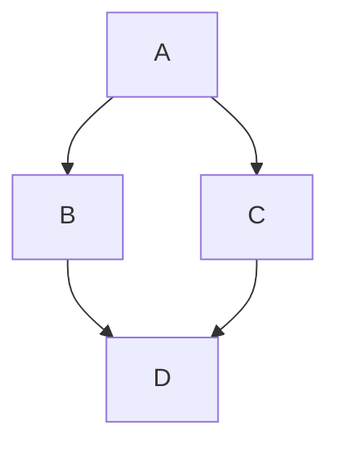

В GitHub [появилась](https://github.blog/2022-02-14-include-diagrams-markdown-files-mermaid/) возможность добавлять в md-файлы динамические диаграммы с помощью генератора Mermaid. До этого диаграммы вставлялись в виде изображений или «рисовались» с помощью символов из ASCII-таблицы. Теперь же полноценную поддержку схем добавили в синтаксис разметки Markdown.

Mermaid — инструмент для построения диаграмм и графиков, основанный на JavaScript. С его помощью можно динамически создавать блок-схемы, UML-диаграммы, графики коммитов и диаграммы Ганта. Команда GitHub объединилась с разработчиками из CommonMark и добавила нативную поддержку синтаксиса Mermaid на платформу. 

Каждый раз, когда в md-файле встречается блок кода, отмеченный как mermaid, система создает новый фрейм iframe, берет необработанный код из блока, передает его в Mermaid.js и превращает код в диаграмму. Все это происходит локально в браузере пользователя.

Следующий блок кода срендерится в полноценную диаграмму, содержимое которой можно будет динамически менять:

Заключение диаграммы в тег iframe позволяет правильно срендерить страницу и не нарушить содержимое файла, а асинхронный ренедеринг упрощает вывод нескольких диаграмма одновременно.
